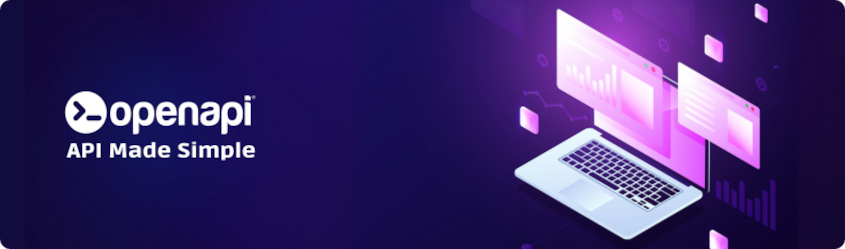

<div align="center">
  <a href="https://openapi.com/">
    
  </a>

  <h1>🧩 Openapi® Skills</h1>
  <h4>Agent skills to interact with <a href="https://openapi.com/">Openapi®</a> APIs from Claude Code and any SKILL.md-compatible agent</h4>

[](https://github.com/openapi/openapi-skills/actions/workflows/skills.yml)
[](https://github.com/openapi/openapi-skills/releases)
[](LICENSE)
[](skills/)
[](https://skills.sh/openapi/openapi-skills)
<br>
[](https://www.linuxfoundation.org/about/members)
</div>

Agent skills for using and integrating the services of the [Openapi](https://openapi.com) API marketplace — the largest certified API marketplace in Europe.

```bash
npx skills add openapi/openapi-skills
```

## Repository layout

| Folder | Purpose |
|---|---|
| [`knowledge/`](knowledge/) | Curated knowledge base: company profile, services catalog, platform guide (auth, billing, sandbox), FAQ, references, per-service endpoint docs and vendored OpenAPI specs |
| [`skills/`](skills/) | The agent skills, one folder per domain, each with a `SKILL.md` |

## Knowledge / skills separation

The two folders have strictly separated roles:

- **`knowledge/` is build-time material.** It is the mass of curated information used to *create and align* the skills (and to refresh them when Openapi changes). It is consulted by maintainers of this repo, not by agents executing a skill.
- **`skills/` are self-contained deliverables.** Each `SKILL.md` is *populated from* the knowledge but never *links to* it: an agent must be able to use a skill without this repository's `knowledge/` folder being available.
- **External references are allowed in skills, but never routed through `knowledge/`.** Skills point directly to official sources — e.g. the canonical specs at `https://console.openapi.com/oas/en/<service>.openapi.json`, the docs portal, the status page — not to local copies of them.

Maintenance flow: update `knowledge/` from the official sources first, then propagate the relevant content into the affected `SKILL.md` files.

## Skills

| Skill | Covers |
|---|---|
| [openapi-auth](skills/openapi-auth/SKILL.md) | OAuth v2 token lifecycle, scopes, wallet, usage stats (required by all others) |
| [openapi-company](skills/openapi-company/SKILL.md) | Company data: Italy, EU, worldwide |
| [openapi-documents](skills/openapi-documents/SKILL.md) | Official documents: visure camerali, balance sheets, DURC, protests (DocuEngine, Visure Camerali, Visengine) |
| [openapi-risk](skills/openapi-risk/SKILL.md) | Credit scores, CRIF reports, KYC, negative events |
| [openapi-trust](skills/openapi-trust/SKILL.md) | Validation of emails, phones, IPs, URLs, PEC, fiscal codes, plates |
| [openapi-geo](skills/openapi-geo/SKILL.md) | Geocoding, zip codes, Italian cadastre, real estate valuations |
| [openapi-messaging](skills/openapi-messaging/SKILL.md) | SMS v2, PEC, Massive REM, postal mail via Poste Italiane |
| [openapi-esignature](skills/openapi-esignature/SKILL.md) | eIDAS e-signatures and qualified time stamping |
| [openapi-invoicing](skills/openapi-invoicing/SKILL.md) | Electronic invoicing (Invoice, SDI) and bill payments |
| [openapi-automotive](skills/openapi-automotive/SKILL.md) | Vehicle data by license plate |
| [openapi-utilities](skills/openapi-utilities/SKILL.md) | Exchange rates, HTML-to-PDF, .it domains, managed RAG |

## Credentials

Skills expect `OPENAPI_EMAIL` and `OPENAPI_API_KEY` (account credentials for `oauth.openapi.com`) and/or a ready-made `OPENAPI_TOKEN` Bearer token in the environment. See [knowledge/platform-guide.md](knowledge/platform-guide.md).

## Contributing

Contributions are always welcome! Whether you want to report bugs, suggest new features, improve documentation, or contribute code, your help is appreciated.

## Authors

- Francesco Bianco ([@francescobianco](https://www.github.com/francescobianco))
- Openapi Team ([@openapi-it](https://github.com/openapi-it))

## Partners

Meet our partners using Openapi or contributing to this project:

- [Blank](https://www.blank.app/)
- [Credit Safe](https://www.creditsafe.com/)
- [Deliveroo](https://deliveroo.it/)
- [Gruppo MOL](https://molgroupitaly.it/it/)
- [Jakala](https://www.jakala.com/)
- [Octotelematics](https://www.octotelematics.com/)
- [OTOQI](https://otoqi.com/)
- [PWC](https://www.pwc.com/)
- [QOMODO S.R.L.](https://www.qomodo.me/)
- [SOUNDREEF S.P.A.](https://www.soundreef.com/)

## Our Commitments

We believe in open source and we act on that belief. We became Silver Members
of the Linux Foundation because we wanted to formally support the ecosystem
we build on every day. Open standards, open collaboration, and open governance
are part of how we work and how we think about software.

## License

This project is licensed under the [MIT License](LICENSE).

The MIT License is a permissive open-source license that allows you to freely use, copy, modify, merge, publish, distribute, sublicense, and/or sell copies of the software, provided that the original copyright notice and this permission notice are included in all copies or substantial portions of the software.

For more details, see the full license text at the [MIT License page](https://choosealicense.com/licenses/mit/).
